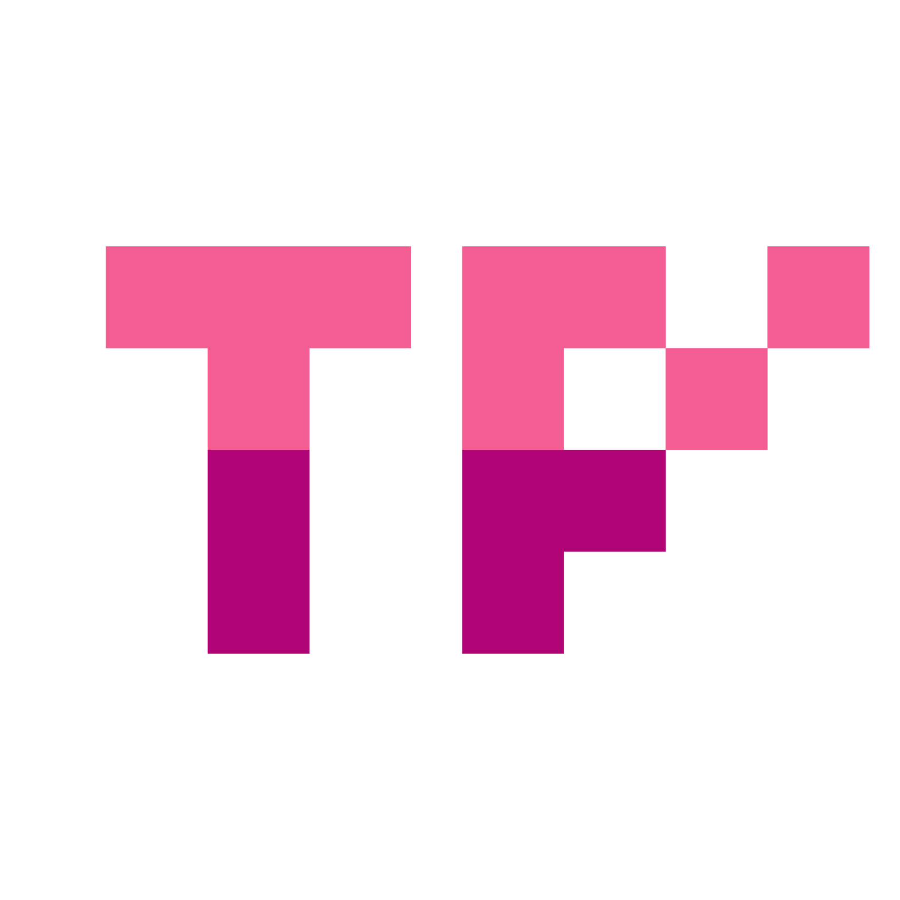

# Twin Pixels

This is an e-commerce project for consoles and videogames sale, made with React JS.

---

## How to build this project.

You will need:

- Node.js (install the recommended version from https://nodejs.org/)
- git

Open your favorite terminal and type these commands:

    git clone https://github.com/GLPG35/TwinPixels.git
    cd TwinPixels/
    npm i
    
That will install all the libraries the project needs to function.
Once installed, now you can:

- Run in developer mode
 
      npm run dev

- Build the project

      npm run build

## Libraries

This is the list of the libraries used on this project:

- [Firebase](https://github.com/firebase/firebase-js-sdk)
- [Framer Motion / Framer Motion 3D](https://github.com/framer/motion)
- [Keen Slider](https://github.com/rcbyr/keen-slider)
- [React](https://github.com/facebook/react)
- [React Icons](https://github.com/react-icons/react-icons)
- [React Router](https://github.com/remix-run/react-router)
- [React Three Fiber](https://github.com/pmndrs/react-three-fiber)
- [Three.js](https://github.com/mrdoob/three.js/)
